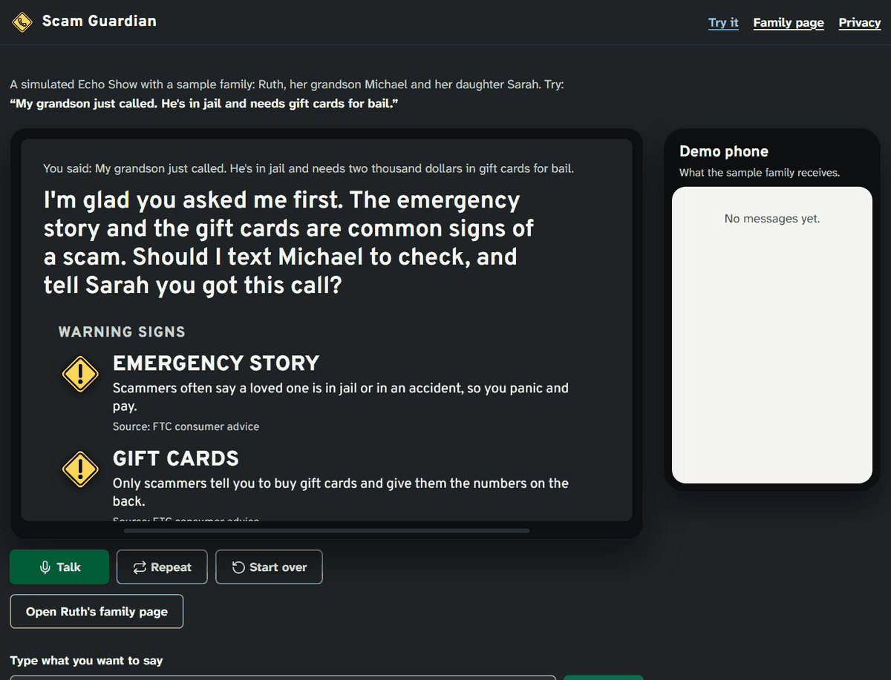
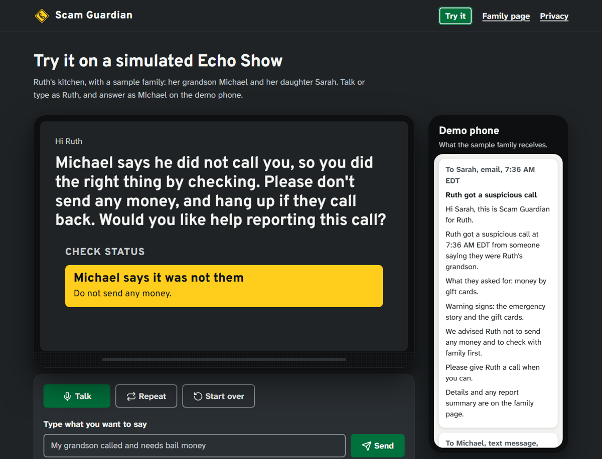
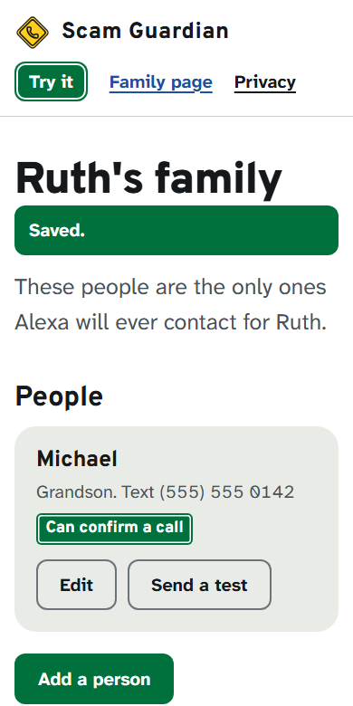
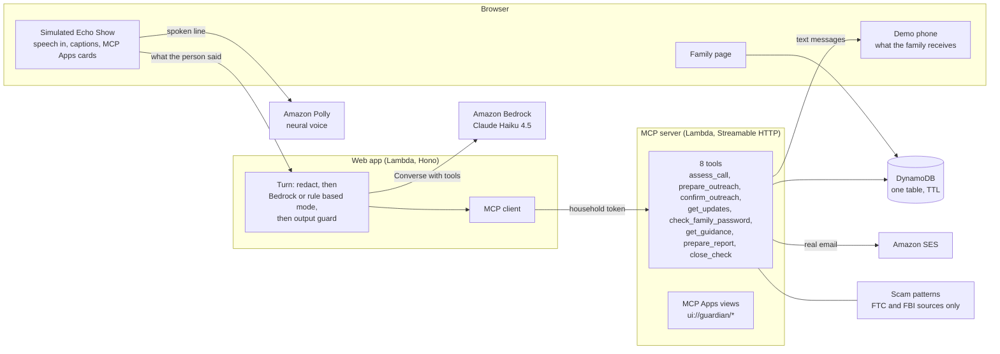

# Scam Guardian for Alexa+

A voice guardian that helps older adults in the United States check a suspicious call before
they pay. They hang up and tell Alexa what happened. Alexa names the warning signs, checks
with the real family member on a number the family saved in advance, says what the family
member answered, and helps them report it.

It never says a payment is safe, never contacts the caller, never asks for card, bank or
Social Security numbers, and never records anything.

Built for the Amazon Developer Hackathon "Build, Ship, Shape", Alexa+ track.



## Why

In 2025, people aged 60 and over filed 201,266 complaints with the FBI's Internet Crime
Complaint Center and reported $7.7 billion in losses
([2025 IC3 Annual Report](https://www.ic3.gov/AnnualReport/Reports/2025_IC3Report.pdf),
complaints by age group). The FTC's advice for a family emergency call is simple: hang up and
check with the family member on a number you know
([FTC consumer advice](https://consumer.ftc.gov/all-scams/family-emergency-scams)). Scam
Guardian turns that advice into a conversation a frightened person can follow.

## What it does

| Moment | What Alexa does |
|---|---|
| "My grandson just called, he's in jail and needs gift cards for bail." | Names the warning signs it heard, each from an FTC or FBI alert, and offers one next step. |
| "Yes." | Texts Michael on the number the family saved, and gives Sarah a heads up. Never the number that called. |
| Michael taps "It wasn't me" | A chime and the light ring show news arrived; Alexa tells Ruth right away if they are still talking, or when she asks what's new. |
| "Help me report it." | Puts a report summary on screen with ReportFraud.ftc.gov, ic3.gov and the DOJ Elder Fraud Hotline. Nothing is filed for her. |
| "I already bought the cards." | No blame: the official first step for that payment method, and an offer to tell family. |
| "He's still on the other phone." | "You can hang up now." Then the check. |
| "There's a man at my door." | Call 911. |



The family organizer sets everything up from a phone: who Alexa can check with, who gets a
heads up, an optional family password, and a history of checks. One button deletes it all.
To look around without an email, "Open Ruth's family page" on the Echo opens the demo family's
page, with the checks just made.



## Try it

- **Hosted demo**: link added after the first deploy (see [docs/deploy.md](docs/deploy.md)).
- **Locally** in two minutes, no AWS account needed:

```bash
pnpm install
pnpm dev
```

Open http://localhost:8787/echo, then type or say:
"My grandson just called. He's in jail and needs two thousand dollars in gift cards for bail."
Each visitor gets a private demo family (Ruth, her grandson Michael, her daughter Sarah). The
demo phone on the right shows what the family receives; tap a reply there to answer as
Michael.

Requirements: Node.js 24 and pnpm 9. Speech input uses the browser's speech recognition
(Chrome or Edge); typing always works.

## Architecture



- **MCP server** ([apps/mcp-server](apps/mcp-server)): the product. Self-hosted, stateless
  Streamable HTTP with MCP TypeScript SDK v2, protocol 2026-07-28 and 2025-11-25 on one
  endpoint. Bearer household tokens (HS256, issuer and audience checked) and OAuth protected
  resource metadata, so an Alexa+ account linking server can issue the same claims. Three
  tools carry MCP Apps views (`text/html;profile=mcp-app`) for the Echo Show screen.
- **Simulated Echo Show** ([apps/web/echo](apps/web/echo)): Alexa+ MCP onboarding is open to
  select partners only (see [FRICTION_LOG.md](FRICTION_LOG.md) #1), so the web app plays the
  device. It is a real MCP Apps host (`AppBridge`) and its agent reaches the MCP server through
  the official MCP client, the way Alexa+ would.
- **Two conversation modes, one conversation**: rules answer what must be exact or instant
  (danger, a caller still on the line, the first description with its official warning signs,
  the answer to a question they asked, known requests like "any news?"); Claude Haiku 4.5 on
  Amazon Bedrock answers free questions and new details with the same MCP tools, within a 3
  second deadline, and reads every line the rules said. Rules also answer when the model is
  slow, unavailable, or over budget. Every sentence goes through the same output guard either
  way. Measured on AWS: [docs/measurements.md](docs/measurements.md).
- **Scam patterns** ([packages/scam-patterns](packages/scam-patterns)): 9 patterns and 17
  warning signs written only from FTC and FBI alerts; every pattern and sign cites its source,
  the schema is checked on every push and a weekly CI job checks that every link still works.
  Published on its own under MIT as
  [Chinorab/us-scam-patterns](https://github.com/Chinorab/us-scam-patterns) for anyone building
  scam help for older adults (`pnpm export:dataset` keeps it in sync).

## Safety by design

The constitution ([.specify/memory/constitution.md](.specify/memory/constitution.md)) sets
eight principles. Each one is enforced in code, not only in the prompt:

| Rule | Where it is enforced |
|---|---|
| Never contact the caller | Outreach tools take member ids only; there is no destination parameter anywhere. Sending is two steps: prepare names every recipient, confirm needs a fresh yes. |
| Never approve a payment | Output guard rejects approval phrases on every sentence, in both modes. |
| No card, bank or Social Security numbers | Redaction runs before anything is stored, logged or sent to the model; the Echo interrupts politely while the number is still being said. |
| No recording | Only what the person describes is used; logs hold ids, enums and timings, checked at runtime. |
| The person decides | Nothing is filed with an agency; reports are summaries with official links. In the full mode the model never answers for the person: the host passes the person's own words to `confirm_outreach`, and a question cannot be confirmed in the turn it was prepared. |
| Official sources only | Every warning sign and every number links to an FTC, FBI or IC3 publication. |

A red team suite of 75 adversarial utterances (pressure to approve, dictated numbers, "call
him back", "tell me the password", the caller still on the line) runs on every push through
the whole path, with fourteen multi turn attacks that arrive in the middle of a check (a new
number in the yes, danger while a question is open, "so I can pay now?" after a relative
confirmed), and a live runner sends the same set to Bedrock
([tests/redteam](tests/redteam)).

## AWS

| Service | Use |
|---|---|
| AWS Lambda (Node.js 24, arm64) with Function URLs | MCP server and web app, no servers to manage |
| Amazon Bedrock (Claude Haiku 4.5, US inference profile) | Full conversation mode: Converse API with the MCP tools as Bedrock tools |
| Amazon DynamoDB | One table, on demand, TTL deletes demo households after 24 hours and checks after 30 days |
| Amazon SES v2 | Real email to family members and sign in links |
| Amazon Polly (neural) | The Echo's voice, slower on "repeat that" |
| AWS Secrets Manager, SSM Parameter Store | One generated master secret; no key in code or template |
| AWS CDK | The whole stack in TypeScript ([infra/src/stack.ts](infra/src/stack.ts)), tested with CDK assertions |

Deploy with one command after `cdk bootstrap`: `pnpm run deploy`. Details, costs and limits:
[docs/deploy.md](docs/deploy.md). Measurements: [docs/measurements.md](docs/measurements.md).

## Alexa+ readiness

When the Alexa+ MCP toolkit opens to all developers, the same server plugs in as an add-on:
Streamable HTTP at `/mcp`, protocol 2025-11-25, fast tool answers (see
[docs/measurements.md](docs/measurements.md)), MCP Apps views for Echo Show screens, protected resource metadata for account linking, and
assistant rules carried in the server instructions.

## Checks

```bash
pnpm check         # lint, format, copy rules, types, then 500+ unit, contract and red team tests
pnpm test:e2e      # Playwright: the Echo and the family page in a real Chromium, axe WCAG 2.2 AA, 200% zoom
pnpm smoke         # pages, security headers, Echo and MCP auth of a running site, local or deployed
pnpm measure       # answer time per turn and time to the check message
pnpm demo:play     # plays the demo video script on the Echo, for screen recording
```

Both the test suites and Playwright run in CI on every push. Every contract test also runs on
the DynamoDB store through an in memory table, so the cloud storage is tested without an AWS
account, and the full conversation mode is tested with a scripted stand in for Bedrock that
issues real tool calls.

## Project documents

- Specification: [specs/001-voice-scam-guardian/spec.md](specs/001-voice-scam-guardian/spec.md)
- Plan and research: [plan.md](specs/001-voice-scam-guardian/plan.md),
  [research.md](specs/001-voice-scam-guardian/research.md)
- Constitution: [.specify/memory/constitution.md](.specify/memory/constitution.md)
- Product feedback: [FEEDBACK.md](FEEDBACK.md)
- Friction log: [FRICTION_LOG.md](FRICTION_LOG.md)
- Privacy: served at `/privacy`

## Credits

- Fonts: [Overpass](https://github.com/RedHatOfficial/Overpass) and
  [Atkinson Hyperlegible Next](https://www.brailleinstitute.org/freefont/) (Braille
  Institute), both under the SIL Open Font License, served through Fontsource.
- Icons: [Lucide](https://lucide.dev), ISC license.
- Scam patterns: written from FTC and FBI publications, cited one by one in the dataset.

## License

MIT, see [LICENSE](LICENSE). Design notes: [DESIGN.md](DESIGN.md).
